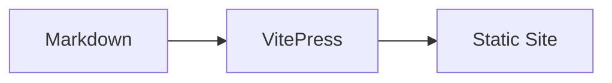
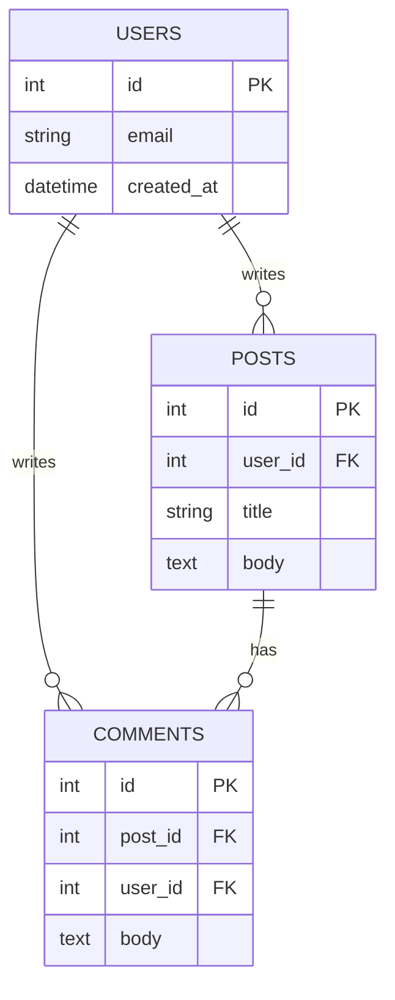

# Markdown Showcase

This page collects common Markdown and VitePress-specific options.

## Headings and text styles

### Level 3 heading

**Bold**, *italic*, ~~strikethrough~~, and `inline code`.

## Lists

- Unordered item
- Another item
  - Nested item

1. Ordered item
2. Next item

- [x] Task done
- [ ] Task pending

## Blockquote

> Markdown blockquote example.
>
> Second line.

## Tables

| Option | Status |
|---|---|
| Markdown tables | ✅ |
| Mermaid diagrams | ✅ |
| Code groups | ✅ |

## Code blocks

```ts
type User = {
  id: number
  name: string
}
```

```js{2}
const env = 'dev'
console.log(`Running in ${env}`)
```

::: code-group

```bash [npm]
npm run docs:build
```

```bash [pnpm]
pnpm docs:build
```

:::

## Custom containers

::: tip
Use tips for quick, helpful notes.
:::

::: warning
Warnings highlight important caveats.
:::

::: danger
Danger is useful for risky actions.
:::

::: details Click to expand
This content is collapsible.
:::

## Mermaid diagrams

### Flowchart



### Database diagram (ER)


