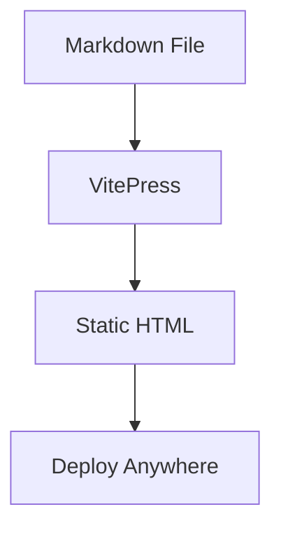
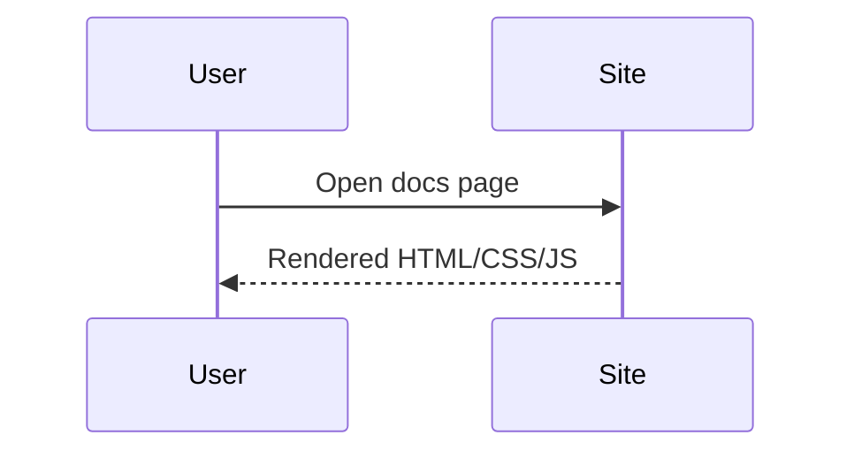

# Mermaid + SVG Example

## Mermaid flowchart

## Mermaid sequence

## SVG from file

If you place an SVG at `docs/public/logo.svg`, you can reference it:

## Inline SVG

<svg width="140" height="140" viewBox="0 0 140 140" xmlns="http://www.w3.org/2000/svg">
  <circle cx="70" cy="70" r="60" fill="#42b883"/>
  <text x="70" y="76" text-anchor="middle" fill="white" font-size="22">SVG</text>
</svg>
